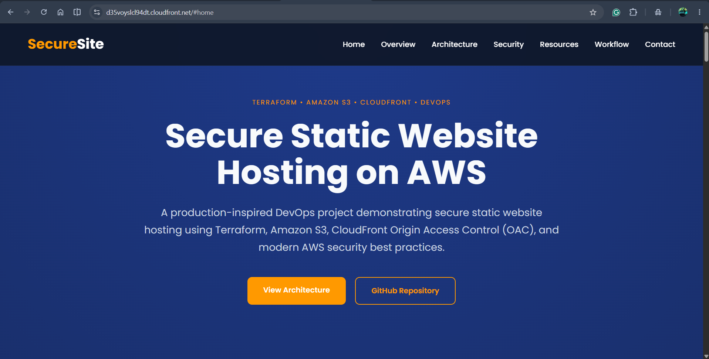
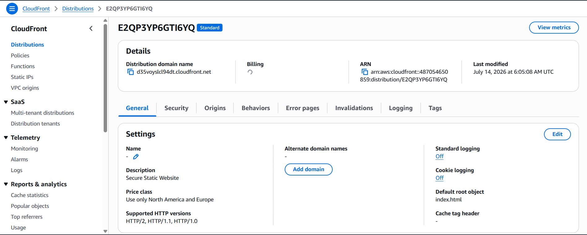
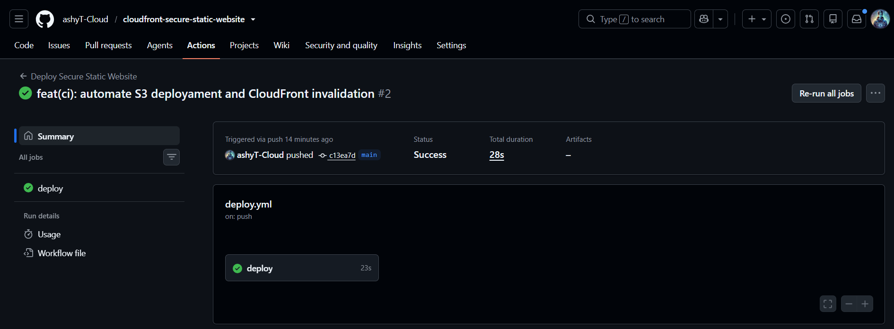
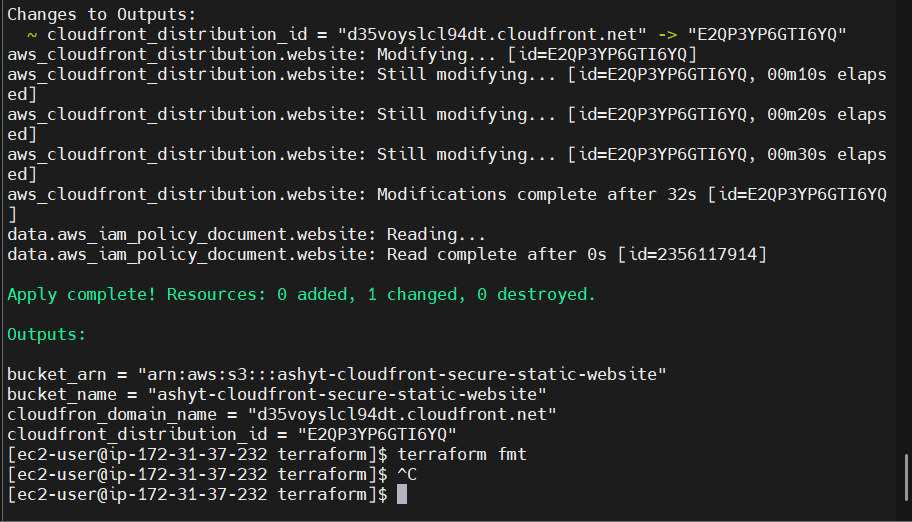
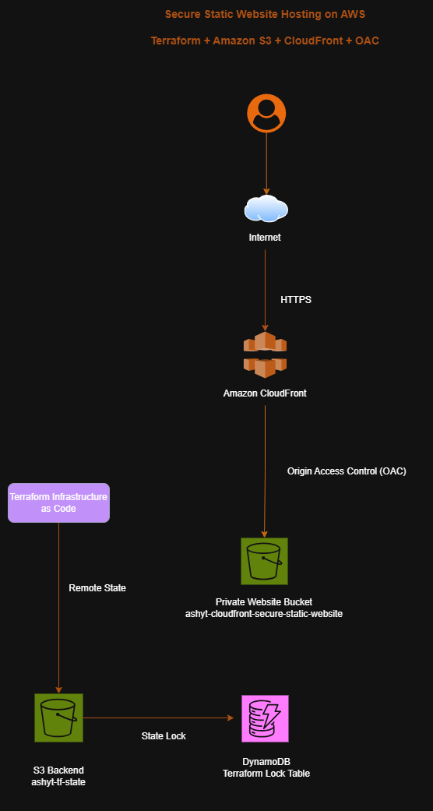

# 🚀 Secure Static Website Hosting on AWS using Terraform, Amazon S3 & CloudFront

> A production-inspired DevOps project demonstrating secure static website hosting using **Terraform**, **Amazon S3**, **Amazon CloudFront**, **Origin Access Control (OAC)**, and **GitHub Actions CI/CD**.


---

# 📌 Project Overview

This project demonstrates how to securely host a static website on AWS following modern cloud security and DevOps best practices.

Instead of making the Amazon S3 bucket public, the website is served through **Amazon CloudFront** using **Origin Access Control (OAC)**. Infrastructure is provisioned using **Terraform**, while **GitHub Actions** automates validation and deployment.

This repository was built as a portfolio project to demonstrate Infrastructure as Code (IaC), CI/CD automation, AWS cloud services, and secure architecture design.

---

# 🏗️ Architecture


### Architecture Flow

```
User
   │
 HTTPS
   │
   ▼
Amazon CloudFront
   │
Origin Access Control (OAC)
   │
   ▼
Private Amazon S3 Bucket
```

Terraform provisions and manages the infrastructure while using:

- Amazon S3 for Remote Terraform State
- Amazon DynamoDB for State Locking

---

# ✨ Features

- Secure Static Website Hosting
- Private Amazon S3 Bucket
- Amazon CloudFront Distribution
- Origin Access Control (OAC)
- HTTPS Content Delivery
- Infrastructure as Code with Terraform
- Remote Terraform State
- DynamoDB State Locking
- GitHub Actions CI Pipeline
- Automated Website Deployment
- CloudFront Cache Invalidation
- Version Controlled Infrastructure
- Production-inspired Repository Structure

---

# ☁️ AWS Services Used

- Amazon S3
- Amazon CloudFront
- Origin Access Control (OAC)
- AWS IAM
- Amazon DynamoDB

---

# 🛠️ Technologies Used

- Terraform
- AWS CLI
- Git
- GitHub
- GitHub Actions
- HTML5
- CSS3
- JavaScript

---

# 📁 Repository Structure

```
.
├── .github/
│   └── workflows/
│       └── deploy.yml
│
├── bootstrap/
│   └── backend/
│
├── terraform/
│   ├── backend.tf
│   ├── bucket-policy.tf
│   ├── cloudfront.tf
│   ├── outputs.tf
│   ├── providers.tf
│   ├── s3.tf
│   ├── variables.tf
│   └── versions.tf
│
├── website/
│   ├── assets/
│   ├── css/
│   ├── js/
│   └── index.html
│
├── docs/
│   ├── architecture/
│   ├── screenshots/
│   └── decisions.md
│
└── README.md
```

---

# 🔐 Security Best Practices

✔ Amazon S3 Block Public Access enabled

✔ Private S3 Bucket

✔ CloudFront Origin Access Control (OAC)

✔ Infrastructure managed using Terraform

✔ Terraform Remote Backend

✔ DynamoDB State Locking

✔ IAM User for GitHub Actions Deployment

✔ GitHub Repository Secrets for AWS Credentials

---

# ⚙️ Infrastructure Provisioned

Terraform provisions the following AWS resources:

- S3 Bucket (Website)
- S3 Bucket Versioning
- Public Access Block
- Bucket Policy
- CloudFront Distribution
- Origin Access Control
- Remote State Bucket
- DynamoDB Lock Table

---

# 🚀 CI/CD Pipeline

The deployment pipeline is powered by **GitHub Actions**.

## Workflow

```
Developer
     │
git push
     │
     ▼
GitHub Actions
     │
     ├── Checkout Repository
     ├── Terraform Format Check
     ├── Terraform Validate
     ├── Validate Website Files
     ├── Upload Website to Amazon S3
     └── CloudFront Cache Invalidation
```

---

# 📷 Screenshots

## Home Page



---

## Amazon CloudFront



CloudFront securely delivers website content over HTTPS using Origin access Control (OAC).

---

## GitHub Actions



The CI/CD pipeline validates Terraform, uploads the website to Amazon S3, and invalidates the Cloudfront cache automatically after every push to the main branch.
---

## Terraform Apply



---

## Architecture Diagram



---


# 📚 Learning Outcomes

This project demonstrates practical experience with:

- Infrastructure as Code
- Terraform
- AWS Cloud Services
- Static Website Hosting
- CloudFront
- Origin Access Control
- CI/CD Pipelines
- GitHub Actions
- Remote Terraform Backend
- Git Branching Strategy
- Cloud Security Best Practices

---

# 🔮 Future Improvements

- Route 53 Integration
- Custom Domain
- AWS Certificate Manager (ACM)
- GitHub OIDC Authentication
- AWS WAF
- CloudFront Logging
- S3 Access Logging
- CloudWatch Monitoring
- Terraform Modules
- Multi-Environment Deployment (Dev/Stage/Prod)

---

# 👨‍💻 Author

**Ashish Thakur**

DevOps | Cloud Engineer | AWS | Terraform | Docker | Kubernetes

GitHub: https://github.com/ashyT-Cloud

---

# ⭐ If you found this project helpful, consider giving it a Star!
